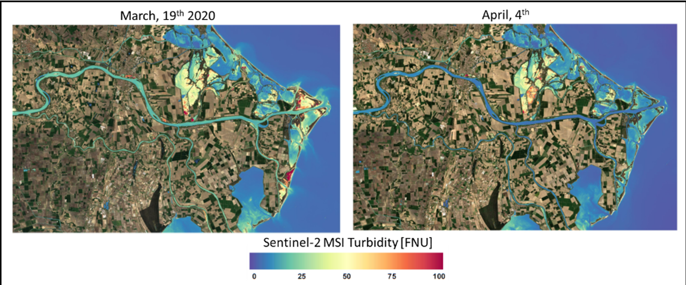

## Impact of COVID-19 on Water Quality

The **Water Quality index** was designed to assess the effect of the lockdown and the subsequent recovery on inland and coastal waters by monitoring the deviation from a climatological mean of Chlorophyll-a concentration as measured from optical sensors onboard the three agency’s satellites, namely **[Sentinel-3 (ESA)](http://www.esa.int/Applications/Observing_the_Earth/Copernicus/Sentinel-3)**, **[GCOM-C (JAXA)](https://global.jaxa.jp/projects/sat/gcom_c/)** and **[Aqua (NASA)](https://oceancolor.gsfc.nasa.gov/data/aqua/)**.

Chlorophyll-a (Chl) concentration is an indicator of algae abundance which fluctuates naturally over space and time, as a result of combined atmospheric and oceanic effects (e.g., marine currents and upwelling). In coastal areas, strongly influenced by river inputs and human activities, higher Chl concentration can result from the discharge of urban sewage, industrial runoffs, and fertilizers from agriculture activities over watersheds. In particular, nutrient inputs of anthropogenic origin affect the natural amount of phytoplankton in marine and inland waters, representing a continuous threat to biodiversity and leading to undesirable modifications of phytoplankton concentration (i.e., eutrophication). 

### Water Quality Time Series

The displayed time series show weekly **Chl-a concentration anomalies (%)** as calculated from **[Sentinel-3](http://www.esa.int/Applications/Observing_the_Earth/Copernicus/Sentinel-3)** (in green), **[MODIS](https://oceancolor.gsfc.nasa.gov/data/aqua/)** (purple) and **[GCOM-C](https://global.jaxa.jp/projects/sat/gcom_c/)** (red) over a specific location (45.30 N, 12.50 E) in the North Adriatic Sea: **the Mediterranean sub-basin**. The basin is most influenced by river runoff, in particular by the **Po River** - the largest river in Italy and which runs along many different industrialized areas. 

Despite existing differences in the characteristics (spatial, temporal and spectral resolution) of the three optical sensors and in the algorithms used to calculate the Chl-a concentration anomalies, all three sensors highlight negative anomalies of Chl concentration during the entire lockdown period, which indicate a water with lower amounts of Chl-a, compared to what is usually observed at this time of the year.
These anomalously low values were found to be the cumulated impact of a number of natural phenomena:

*Figure 1. a-Po river level from March, 16th 2020 to June, 15th 2020. b- Mean Sea Surface Temperature for the  week 1st – 8th April (left plot) and for the week 8th-14th April 2020 (right plot). c- Wind measurements in the area from March, 20th to April, 15th  2020*

#### Anomalously low Po river discharge:

Water level data of Po River at Pontelagoscuro station (~50 km upstream the river mouth) show that the lowest values of Chl concentration anomalies occur during the minimum hydrometric level, recorded between 15 and 20 April 2020 (Fig. 1a) which likely led to a mild advection of cold riverine waters from the Po River tributaries; 

#### Anomalously high Sea Surface Temperature:

Such hypothesis is confirmed by significant increase of SST off the Po River delta (Fig. 1b). Moreover, the particularly worm bulge and the associated SST pattern along the north-west coast of the basin mark a reduction of the well-known cyclonic, cold coastal current that constitute the natural conveyor belt of the North Adriatic river plumes, i.e., the primary source of nutrient and sediment loads that flow southward.  

#### Anomalously low winds:

On top of this particular low-runoff, high-SST condition off the whole coastal zone of the study area, low wind magnitudes were recorded (Fig.1c), which, by preserving the vertical stratification of the water column, hindered upwelling of nutrient-rich waters that may enhance the growth of phytoplankton.   

Concluding, the significant negative anomalies of weekly Chl concentration observed in this area during the lockdown period are likely due to natural environmental factors, driven by the particular low Po River water level, low winds, and the resulting well-stratified thermohaline conditions that maintained values of Chl concentration fairy low and hindered riverine sediment and nutrient transport from the northern sector of the basin. 
However, we cannot exclude a mutual role of a decrease of human activities that enhanced the negative anomaly in Chl concentration as highlighted by the low turbidity values in the Po river measured by Sentinel-2 in the lockdown phase (Fig. 2)

*Figure 2. S2-derived turbidity maps in the last inland branch of the Po River March, 19th 2020 (beginning of lockdown) and April, 4th (middle of lockdown).*